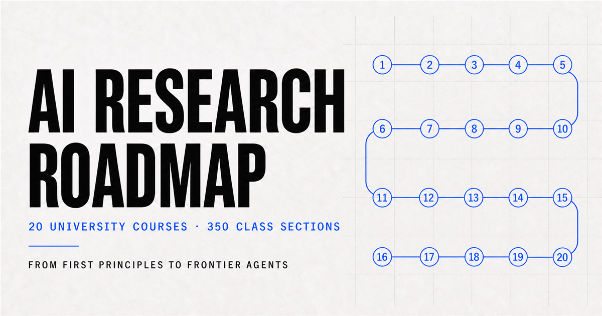

# AI Research Roadmap

**Learn the field. Build the frontier.** AI Research Roadmap is a prerequisite-aware learning and research workspace that brings rigorous university courses, lectures, readings, assignments, papers and personal study progress into one focused application.



## Why it exists

Advanced AI material is abundant but fragmented. Courses live on different university sites, prerequisites are rarely shown as one path, and personal progress is separated from research reading. This project organizes **20 university courses and 350 lectures** into a coherent roadmap from programming and mathematical foundations to modern machine learning, language models, computer vision, reinforcement learning, AI systems, safety and frontier research.

The curriculum prioritizes official public material from institutions including Harvard, UC Berkeley, MIT and Stanford. It links back to the original sources and adds structure, sequencing and a personal research workspace around them.

## Core experience

- Prerequisite-aware university course roadmap
- Complete lesson timelines with videos, readings, slides, assignments and projects
- Course search and resource filters
- Progress tracking at lesson and roadmap level
- Bookmarks, favourites and private study notes
- Resume-from-last-lesson workflow
- Research library covering concepts, papers, readings, videos and algorithms
- Information Theory × AI specialization path
- Custom research-source collection
- Responsive interface for desktop and mobile study

## Research library

The library complements the course roadmap with reusable reference collections:

| Collection | Purpose |
| --- | --- |
| Dictionary | More than 1,000 course-aligned AI concepts |
| Primers | Deep topic guides and technical explanations |
| Algorithms | Patterns, complexity and implementation references |
| Data structures | Core computational representations and trade-offs |
| Papers | Seminal and current research across AI fields |
| Readings | Books, essays, notes and long-form resources |
| Videos | University lectures, talks and visual explanations |
| Information theory | An ordered path from entropy to modern AI research |
| Favourites | A personal read-and-study queue |

## Technology

| Layer | Technology |
| --- | --- |
| Interface | React 19 and TypeScript |
| Application runtime | Vinext and Vite |
| Styling | Tailwind CSS 4 and application CSS |
| Persistence | Cloudflare D1 with Drizzle ORM |
| Hosting | OpenAI Sites / Cloudflare-compatible worker runtime |
| Testing | Node test runner, ESLint and production builds |

## Architecture

```text
app/
  StudyApp.tsx             Roadmap, course and lesson experience
  LibraryApp.tsx           Research-library interface
  course-data.ts           Structured curriculum and official resources
  library.ts               Library taxonomy and specialization paths
  api/                     Study state, sources and document endpoints
db/                        D1/Drizzle schema
drizzle/                   Database migrations
tests/                     Rendered-output validation
worker/                    Runtime entry point
public/                    Brand and Open Graph assets
```

## Run locally

Requirements: Node.js 22.13 or later.

```bash
npm install
npm run dev
```

Then open the local URL shown by Vinext.

## Quality checks

```bash
npm run lint
npm test
npm run build
```

## Database

The D1 schema stores user-specific study state, bookmarks, notes and custom sources. Generate migrations after changing `db/schema.ts`:

```bash
npm run db:generate
```

The application is designed so public learning content can be browsed without exposing another user's private study data.

## Source and copyright policy

This repository contains the application code, original interface assets and structured links to public educational sources. It does **not** redistribute the third-party university PDFs used during private study. Course names and links identify their respective institutions; no institutional endorsement is implied. Always follow the licence and terms published by each original source.

## Product principles

- Preserve the institution's real course order and prerequisites.
- Prefer official sources over summaries or substitute videos.
- Distinguish missing public material instead of inventing replacements.
- Keep research notes and individual progress private.
- Make the path understandable without reducing its academic depth.
- Treat the roadmap as a living research system, not a static link list.

## Author

Created by **Beatriz Pereira Ferreira** as a long-term AI learning and research workspace, with Codex used to support implementation, source mapping, validation and documentation.
